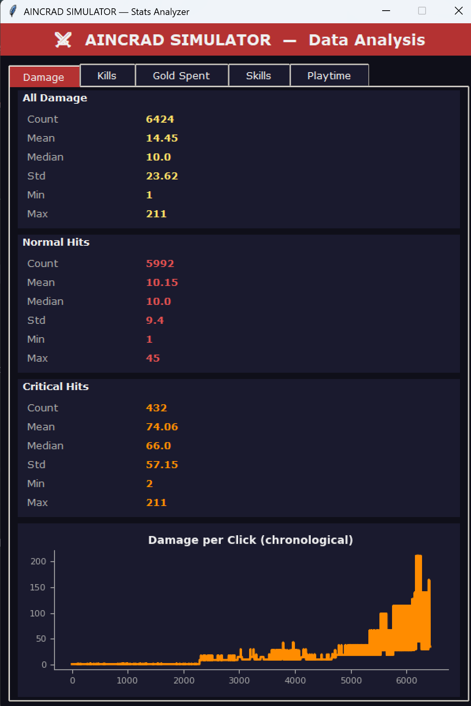
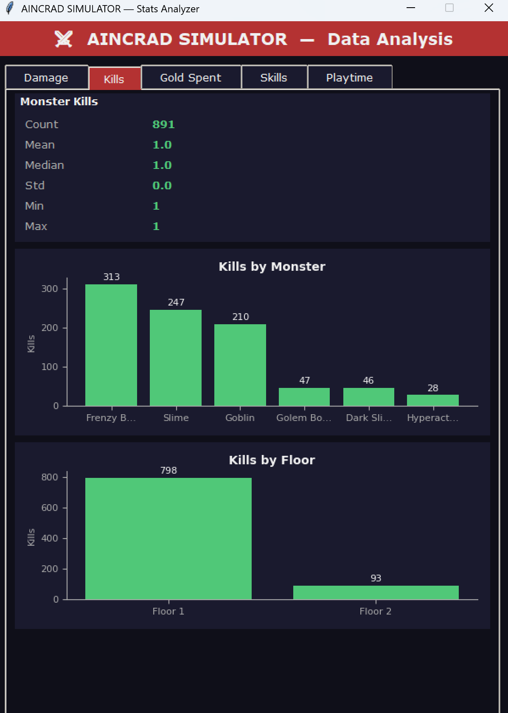
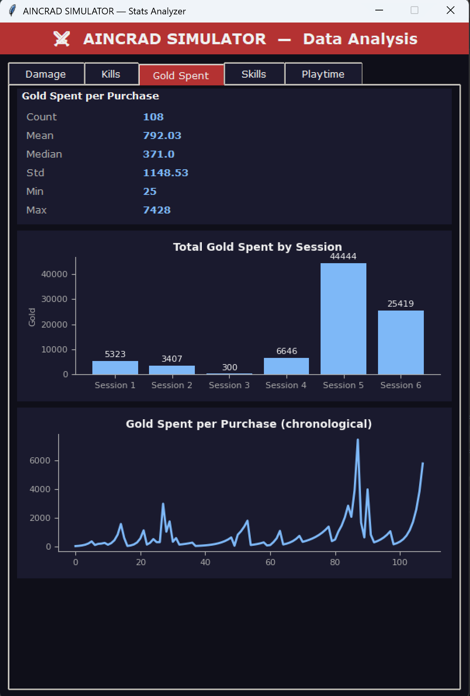
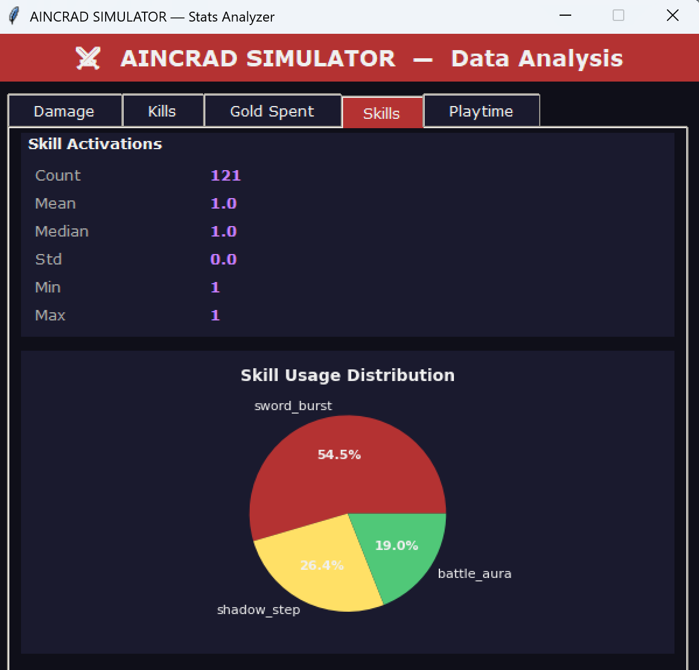
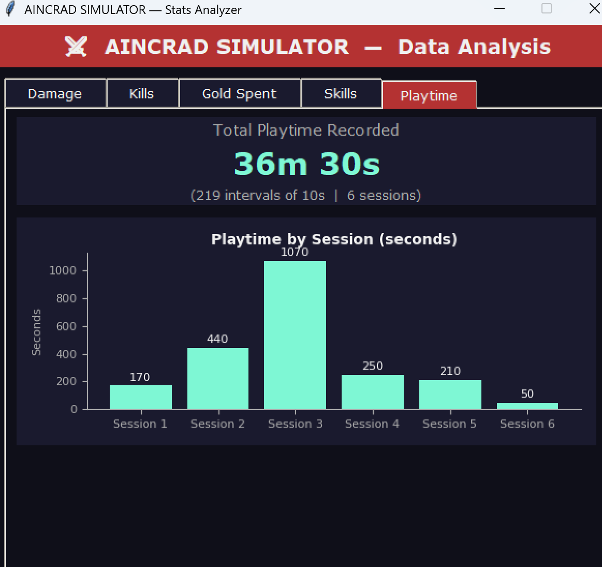

# VISUALIZATION.md
# AINCRAD SIMULATOR — Data Visualization Documentation

This file documents all data visualizations in the AINCRAD SIMULATOR statistics system. 
All visualizations are drawn inside a standalone `analysis.py` program using Tkinter Canvas primitives. 
Data is collected automatically during gameplay and stored in a single CSV file: `saves/stats.csv`.

---

## Overview

The statistics program contains **5 tabs**, each dedicated to one gameplay feature:

| Tab | Visualization | Feature |
|---|---|---|
| Damage | Line Chart | Damage dealt per click over time |
| Kills | Bar Chart | Monster kills by type and by floor |
| Gold Spent | Bar Chart + Line Chart | Upgrade purchases over sessions |
| Skills | Pie Chart | Active skill usage distribution |
| Playtime | Bar Chart | Time spent per session |

---

## Data Collection — `saves/stats.csv`

All events are written by `StatsTracker` in `src/stats_tracker.py`. 
Every row shares the same 6 columns:

| Column | Description | Example |
|---|---|---|
| `timestamp` | Date and time of the event | `2026-04-16 02:25:44` |
| `event_type` | Type of event recorded | `damage`, `kill`, `purchase`, `skill`, `playtime` |
| `value` | Numeric value of the event | `43` (damage), `1` (kill), `500` (gold spent) |
| `metadata` | Extra context for the event | `crit`, `normal`, `Goblin`, `sword_burst` |
| `floor_id` | Floor where the event happened | `1`, `2` |
| `session_id` | Unique 8-character ID per session | `919f5955` |

---

## 1. Damage per Click — Line Chart

**Tab:** Damage  
**File column used:** `event_type = "damage"`, `value`, `metadata`

This line chart shows the damage value of every click in chronological order across all recorded sessions. Normal hits and critical hits are both included in the same line. Critical hits (`metadata = "crit"`) appear as spikes above the baseline.

**Statistical values displayed:** Mean, Median, Std, Min, Max, Count — split across All Damage / Normal Hits / Critical Hits.

---

## 2. Monster Kills — Bar Chart

**Tab:** Kills  
**File column used:** `event_type = "kill"`, `metadata` (monster name), `floor_id`

Two bar charts are displayed in this tab. The first shows total kills grouped by monster name, and the second shows kills grouped by floor.

**Statistical values displayed:** Mean, Median, Std, Min, Max, Count.

---

## 3. Gold Spent — Bar Chart + Line Chart

**Tab:** Gold Spent  
**File column used:** `event_type = "purchase"`, `value` (gold spent), `session_id`

This tab shows two visualizations. The first is a bar chart grouping total gold spent by session ID. The second is a line chart showing the gold cost of each individual purchase in chronological order.

**Statistical values displayed:** Mean, Median, Std, Min, Max, Count.

---

## 4. Active Skill Usage — Pie Chart

**Tab:** Skills  
**File column used:** `event_type = "skill"`, `metadata` (skill ID)

This pie chart shows the proportion of skill activations across all recorded sessions, with each slice representing one active skill.

**Statistical values displayed:** Count per skill ID — percentage calculated as `count / total * 100`.

---

## 5. Playtime — Bar Chart

**Tab:** Playtime  
**File column used:** `event_type = "playtime"`, `value` (always 10), `session_id`

`StatsTracker.update()` writes one row every 10 seconds of gameplay. This tab counts those rows per session and multiplies by 10 to get total seconds played.

**Statistical values displayed:** Total playtime (sum), session count, interval count.

---

## Statistical Values Summary

| Feature | Mean | Median | Std | Min | Max |
|---|---|---|---|---|---|
| Damage dealt | ✓ | ✓ | ✓ | ✓ | ✓ |
| Monster defeated | ✓ | ✓ | ✓ | ✓ | ✓ |
| Gold spent | ✓ | ✓ | ✓ | ✓ | ✓ |
| Skill activation | ✓ | ✓ | ✓ | ✓ | ✓ |
| Playtime | — | — | — | — | — (sum displayed) |